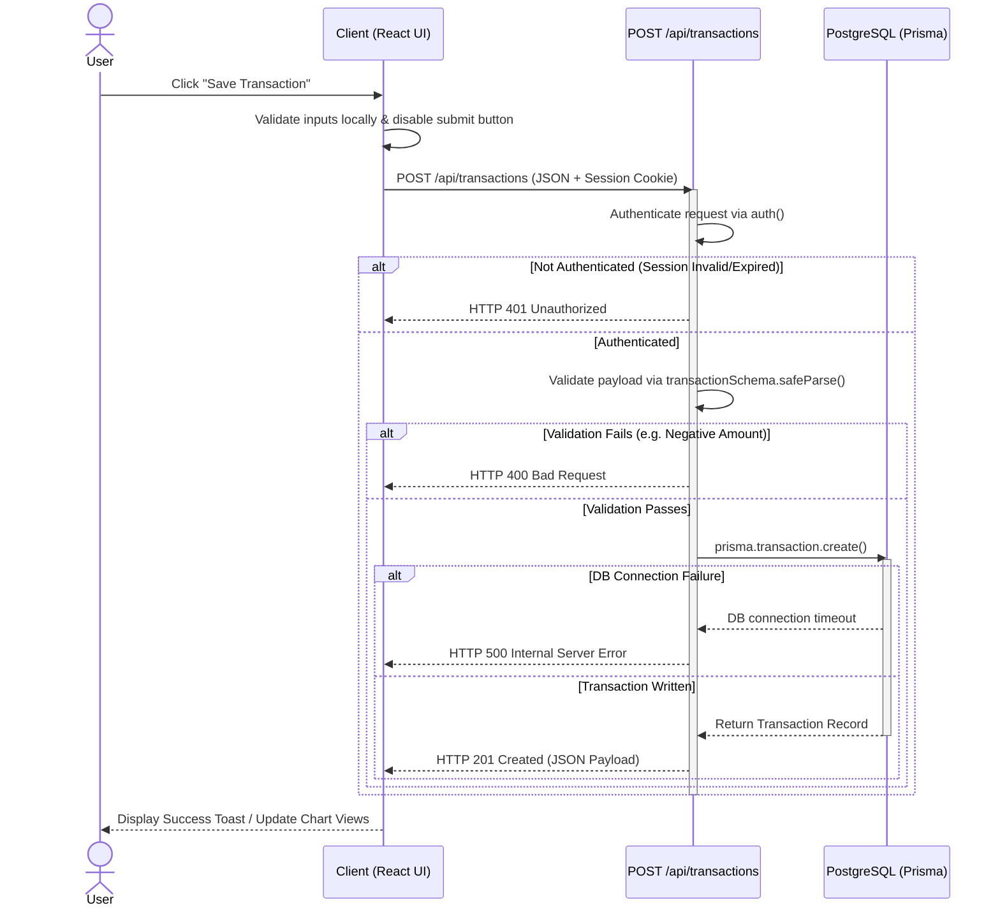

# System Draft v0: Expense Vault

This document compiles the architectural decisions, workflow designs, API contracts, reliability strategies, and repository implementation traces for **Expense Vault** (Personal Finance & Expense Splitting Manager).

---

## Part 1 - Problem Framing

### What the System Does
**Expense Vault** is a centralized personal finance management system that enables users to:
- Track daily transactions (income and expenses) with fields for category, date, description, currency, and receipt URLs.
- Manage category-based budgets (weekly, monthly, or yearly) with automated limit checks.
- Set reminders for upcoming bills and log recurring transactions (subscriptions/utilities) that auto-renew.
- Split bills among group members within custom "Split Groups" and track who owes whom.
- Generate AI-driven financial insights and parse natural language expressions (e.g., *"Spent 450 at Swiggy yesterday"*) into structured transactions using LLMs.
- Export monthly summaries as clean, downloadable PDF reports.

### What the System Does NOT Do
- **No Direct Bank Integration**: The system does not connect directly to user bank accounts, credit card portals, or open banking APIs (e.g., Plaid). All transactions must be manually logged or entered via the NLP parser.
- **No Real Monetary Transactions**: The system does not execute actual wire transfers, credit card payments, or settle debts via payment gateways (e.g., Stripe, UPI). It only acts as an accounting ledger.
- **No Investment Tracking**: It does not support stock, mutual fund, pension, or cryptocurrency portfolio tracking.

### How Success is Measured
- **User Retention & Engagement**: Measured by the frequency of recurring visits and the number of active transactions logged weekly (aiming for users logging >85% of their daily discretionary expenses).
- **Natural Language Parsing Accuracy**: Percentage of natural language inputs parsed with confidence >0.85 without requiring manual corrections (target: >90%).
- **API Performance & Reliability**: Maintaining API response latency below **150ms** for CRUD transactions (excluding external LLM calls) and achieving **99.9% uptime** on core endpoints.

### Evolution of the System Idea
Originally, the project was envisioned as a simple single-user budget tracker. During development, we identified that manual entry is the main cause of user drop-offs. To resolve this friction, the scope was expanded to include:
1. **NLP Text Parsing** to minimize form-filling overhead.
2. **Split Groups** to handle multi-user shared expenses, expanding the database schema to handle group memberships and debt state tracking.
3. **Upstream rate-limit adaptation** (handling Groq HTTP 429 exceptions) to ensure the AI-integrated flows remain robust under high usage.

---

## Part 2 - Workflow Model: Transaction Creation

The chosen primary workflow is the **Transaction Creation Workflow** (creating an income or expense record).

### IPO Model & Use Case Slice

| Component | Description |
| :--- | :--- |
| **Trigger** | User fills out the transaction form on the UI and clicks "Save Transaction" (or confirms a parsed NLP card), dispatching an HTTP `POST` request to `/api/transactions`. |
| **Inputs** | JSON payload containing: `title`, `amount`, `type` (INCOME/EXPENSE), `category`, `date`, `currency` (optional), `description` (optional), and `receiptUrl` (optional), plus user session cookies. |
| **Process Flow** | 1. **Auth Check**: Session cookie verified via `auth()`. Retrieves user ID. <br>2. **Input Validation**: Request body parsed with Zod schema `transactionSchema`. <br>3. **Data Coercion**: Normalizes inputs (dates parsed to ISO objects, amounts validated as positive decimals). <br>4. **DB Write**: Record created in PostgreSQL via Prisma. <br>5. **Response Return**: Transaction returned with a `201 Created` status. |
| **Output / State Change** | A new row is written to the `Transaction` table in the database associated with the user's `userId`, updating the user's balance and monthly budget progression dynamically. |



### Important Failure Point & System Behavior
- **Failure Point**: Database connection failure or connection pool exhaustion (Prisma throws an exception).
- **System Action**: Rather than crashing the serverless function or returning database stack traces, the API route wraps the write operation in a `try-catch` block. It logs the internal database error to a server-side monitoring console and returns a clean, obfuscated HTTP `500 Internal Server Error` response with the body `{"error": "Failed to create transaction"}`. The client-side UI intercepts the 500 status and alerts the user via a friendly toast message: *"Unable to save transaction. Please try again in a moment."* without losing the user's unsaved form data.

---

## Part 3 - API Contract

We design the transaction creation endpoint: `POST /api/transactions`.

### 1. Contract Style
- **Selected: REST (Representational State Transfer)**
  - **Why REST?**: The transaction workflow is a standard resource-oriented operation (creating an instance of a `Transaction` resource). REST matches HTTP verbs directly (POST to create, GET to read, PATCH to update, DELETE to delete). It leverages standard HTTP status codes (201, 400, 401, 500) for error propagation and is natively supported in Next.js App Router API handlers without needing thick layers of middleware.
  - **Why GraphQL is not suitable**: GraphQL introduces heavy setup complexity (schemas, queries, resolvers) that is unwarranted for a straightforward CRUD application. We do not have complex client-defined data requirements or over-fetching issues that would justify the overhead of a GraphQL engine.
  - **Why gRPC is not suitable**: gRPC relies on HTTP/2 and Protobuf serialization. While excellent for low-latency backend microservices, executing gRPC calls directly from standard browser clients requires translating proxies (like gRPC-web). A standard web client communicating with a Next.js server-side router is far easier to build and debug using JSON-over-REST.

### 2. Request Shape
- **Required Fields**:
  - `title`: `string` (length: 1–100 characters)
  - `amount`: `number` (must be a positive decimal/float)
  - `type`: `string` (enum: `"INCOME"` or `"EXPENSE"`)
  - `category`: `string` (non-empty string matching standard categories, e.g., `"Food & Dining"`)
  - `date`: `string` (ISO 8601 formatted datetime string, e.g. `"2026-07-16T11:50:00.000Z"`)
- **Optional Fields**:
  - `description`: `string` | `null` (extra notes, maximum 500 characters)
  - `currency`: `string` (defaults to `"INR"`)
  - `receiptUrl`: `string` | `null` (valid URL format linking to uploaded receipt storage)
  - `splitGroupId`: `string` | `null` (links to an existing SplitGroup CUID)

*Example Request Payload*:
```json
{
  "title": "Grocery Shopping at Zepto",
  "amount": 849.50,
  "type": "EXPENSE",
  "category": "Groceries",
  "description": "Weekly food stock-up",
  "date": "2026-07-16T11:50:00.000Z",
  "currency": "INR",
  "receiptUrl": "https://storage.expensevault.com/receipts/rec_982734.jpg"
}
```

### 3. Response Shape (HTTP 201 Created)
- Returns the complete created database record.
- **Main Response Fields**:
  - `id`: `string` (CUID format unique identifier)
  - `title`: `string`
  - `amount`: `number` (returned as a float number)
  - `type`: `"INCOME"` | `"EXPENSE"`
  - `category`: `string`
  - `description`: `string` | `null`
  - `date`: `string` (ISO datetime)
  - `receiptUrl`: `string` | `null`
  - `currency`: `string`
  - `userId`: `string` (CUID of the owner user)
  - `splitGroupId`: `string` | `null`
  - `createdAt`: `string` (ISO creation timestamp)
  - `updatedAt`: `string` (ISO update timestamp)
- **Expand Parameters**: The endpoint supports `?expand=splitGroup` as a query parameter. If supplied, the response merges the split group details instead of just returning the CUID:
  - `splitGroup`: `{ id: string, name: string, totalAmount: number }` | `null`

*Example Response Payload*:
```json
{
  "id": "cly1234567890abcdef",
  "title": "Grocery Shopping at Zepto",
  "amount": 849.50,
  "type": "EXPENSE",
  "category": "Groceries",
  "description": "Weekly food stock-up",
  "date": "2026-07-16T11:50:00.000Z",
  "currency": "INR",
  "receiptUrl": "https://storage.expensevault.com/receipts/rec_982734.jpg",
  "userId": "user_clx087123",
  "splitGroupId": null,
  "createdAt": "2026-07-16T06:20:38.102Z",
  "updatedAt": "2026-07-16T06:20:38.102Z"
}
```

### 4. Failure Codes

- **HTTP 401 Unauthorized**
  - **Trigger**: No valid session cookie found in request headers (user not logged in).
  - **Error Payload**:
    ```json
    {
      "error": "Unauthorized"
    }
    ```
- **HTTP 400 Bad Request**
  - **Trigger**: Schema validation fails (e.g., negative amount value or empty title).
  - **Error Payload**:
    ```json
    {
      "error": "Amount must be positive"
    }
    ```
- **HTTP 500 Internal Server Error**
  - **Trigger**: Prisma database connection fails or queries crash during insert.
  - **Error Payload**:
    ```json
    {
      "error": "Failed to create transaction"
    }
    ```

### 5. Versioning
- **Versioning Strategy**: Versioning is handled via the URL namespace (e.g., `/api/v1/transactions`). The current baseline v0 routing is bound to `/api/transactions` for simplicity, but moving forward, major revisions will transition to `/api/v2/...`.
- **What Causes a Version Bump**:
  - Changing an optional field into a required field (e.g., making `category` strict or requiring a `splitGroupId`).
  - Renaming fields in the payload (e.g., renaming `receiptUrl` to `invoiceImage`).
  - Dropping support for existing data shapes or shifting decimal values to integer cents (which would break client integrations expecting raw floats).

---

## Part 4 - Reliability Notes

### Error Handling
Errors are caught at the controller/route level using structured `try-catch` wrapper limits.
- Validation errors originating from Zod schemas are intercepted and returned directly as HTTP `400 Bad Request` responses containing the specific validation issue (e.g., `"Title is required"`), keeping error strings descriptive for client-side rendering.
- Database query failures or network exceptions are logged internally with stack traces to server logs but return a generic `"Failed to create transaction"` HTTP `500` message to protect database structural schemas and connection endpoints (security boundary).

### Retry Safety or Idempotency
- By REST standards, `POST` requests are non-idempotent. If a POST network request hangs, retrying it blindly can result in duplicate transaction logs.
- *Mitigation*: Clients should handle transient disconnects by querying the transaction list to check if a record with the same details exists before executing a retry, or wait for server confirmation.

### Duplicate Request Handling
- **Client-Side**: The web application form sets an `isSubmitting` reactive flag inside the React component state, immediately disabling the submit button when clicked. This blocks rapid double-clicking by the user.
- **Server-Side**: The database schema enforces a unique constraint on `@unique([userId, category, period])` for budgets to avoid duplicate budget assignments. For transactions, we rely on the client-side locking mechanism in v0.

### Rate Limiting Decision
- **Upstream Rate Limiting (Groq AI)**: Our NLP parsing and insights APIs trigger external calls to Groq API (`llama-3.3-70b-versatile`). We catch the Groq HTTP `429 Rate Limit Reached` response status explicitly and translate it to a friendly client response: `{"error": "AI rate limit reached. Please wait a moment and try again."}` with HTTP status `429`.
- **Internal API Rate Limiting**: Next.js serverless default request limits are inherited. In production, we plan to use a token-bucket rate limiter middleware (e.g., using Upstash Redis) limiting users to 120 API requests per minute for transaction writes to mitigate script attacks.

### Versioning Signal
- In addition to standard URI routing (`/api/v1/...`), the client application transmits a custom `X-App-Version` HTTP header with every request. This enables the server to detect deprecated native application builds and dynamically prompt users to reload or update their client.

### Intentionally Left Open Reliability Gap & Justification
- **Gap**: Lack of server-side transaction idempotency ledgers (e.g. `Idempotency-Key` tracking using Redis key-value storage).
- **Justification**: Setting up a Redis-based distributed lock system or tracking UUID idempotency keys with standard TTLs adds hosting costs and infrastructure complexity (managing cache synchronization, connection pool limits for serverless handlers). For a personal finance tracker, UI-level button disabling and client-side lock state provide a sufficient buffer against user errors at zero infrastructure cost during MVP stage.

---

## Part 5 - Open Questions

### 1. One Rejected Design Alternative & Why
- **Alternative**: Automatic real-time transaction syncing by integrating with bank portals using the Plaid API.
- **Why Rejected**: Plaid integration requires a high fixed monthly cost and demands a legally registered business entity to access production bank APIs, which is prohibitive for a student capstone budget. Additionally, user feedback showed strong security reservations about connecting real banking credentials to a new dashboard. We instead chose manual entry augmented by the Groq NLP parser, offering high convenience with zero third-party credential risk.

### 2. One Remaining Production Risk
- **Risk**: Hard dependency on the Groq API for Natural Language processing. If Groq experiences downtime or changes its response formatting, our NLP creation flow will break, parsing invalid items or returning `500 AI parsing failed` to users. This disrupts the core value proposition of frictionless entries.

### 3. One Unresolved Design Question
- **Question**: How should we model multi-currency settle-ups inside Split Groups? Currently, split members hold shares represented as plain decimal values in the default database currency (INR). If Member A pays in USD and Member B splits in EUR, our system lacks the real-time cross-currency ledger conversion logic to settle exact currency differences, risking exchange rate loss. Determining whether to bind the entire split group to a single base currency or support floating real-time currency conversions remains an open question.

---

## Part 6 - Repository Trace

Here is the trace of the **Input Validation and Error Handling** design decision into the actual repository source code.

### 1. File Names
- Schema definition: [validators.ts](file:///d:/S51_Shaswath_ExpenseManager/expense-vault/src/lib/validators.ts)
- Route handler: [route.ts](file:///d:/S51_Shaswath_ExpenseManager/expense-vault/src/app/api/transactions/route.ts)

### 2. Entry Point
The entry point is the asynchronous `POST` function in `src/app/api/transactions/route.ts`:
```typescript
export async function POST(req: Request) { ... }
```

### 3. Processing Flow
1. **Authentication**: The controller checks if the user session exists using the NextAuth handler:
   ```typescript
   const session = await auth();
   if (!session?.user?.id) {
     return NextResponse.json({ error: "Unauthorized" }, { status: 401 });
   }
   ```
2. **Payload Parsing**: The JSON request body is extracted:
   ```typescript
   const body = await req.json();
   ```
3. **Zod Validation**: The body is parsed using the imported validator schema:
   ```typescript
   const parsed = transactionSchema.safeParse(body);
   ```
4. **Validation Handling**: If Zod validation fails, `parsed.success` is false. The system extracts the first validation error message and aborts the request, returning a `400` status:
   ```typescript
   if (!parsed.success) {
     return NextResponse.json(
       { error: parsed.error.issues[0].message },
       { status: 400 }
     );
   }
   ```
5. **Database Write**: If validation passes, the validated data is merged with the session `userId` and saved to PostgreSQL via Prisma Client:
   ```typescript
   const transaction = await prisma.transaction.create({
     data: {
       ...parsed.data,
       userId: session.user.id,
       receiptUrl: body.receiptUrl || null,
     },
   });
   ```
6. **Response Serialization**: The record is returned to the client, converting the database Decimal representation to a JavaScript number to avoid JSON conversion issues:
   ```typescript
   return NextResponse.json(
     { ...transaction, amount: Number(transaction.amount) },
     { status: 201 }
   );
   ```

### 4. Where the Status Code is Set
- **HTTP 401 Unauthorized**: Set on line 9 inside [route.ts](file:///d:/S51_Shaswath_ExpenseManager/expense-vault/src/app/api/transactions/route.ts#L9).
- **HTTP 400 Bad Request**: Set on line 63 inside [route.ts](file:///d:/S51_Shaswath_ExpenseManager/expense-vault/src/app/api/transactions/route.ts#L63).
- **HTTP 201 Created**: Set on line 77 inside [route.ts](file:///d:/S51_Shaswath_ExpenseManager/expense-vault/src/app/api/transactions/route.ts#L77).

### 5. Difference Between Design Contract and Actual Code Behavior
- **Type Coercion**: The design contract specifies a strict numeric data format for transaction amounts. However, in the actual implementation within `src/lib/validators.ts`, the amount uses `z.coerce.number()`. This means that if a client sends a numeric string like `"250.00"`, the Zod validator silently transforms it into the number `250` instead of failing the request, introducing an implicit fallback translation.
- **Payload/Schema Mismatch**: The validation schema defines standard properties, but the `receiptUrl` parameter is parsed directly from the raw `body.receiptUrl || null` rather than being mapped inside the strict Zod parse block. This splits validation duties between the schema parser and inline fallback ternaries in the controller.
- **Precision Loss**: The database schema stores amounts as `Decimal(12, 2)` (supporting exact currency arithmetic). However, the API controller casts this to standard JavaScript double-precision floats using `Number(transaction.amount)` before returning it to the client. This violates strict currency storage design contracts (which suggest handling money as strings or integer cents) and opens up potential floating-point rounding errors on the client.
